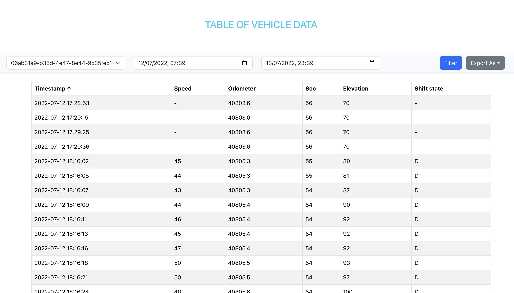
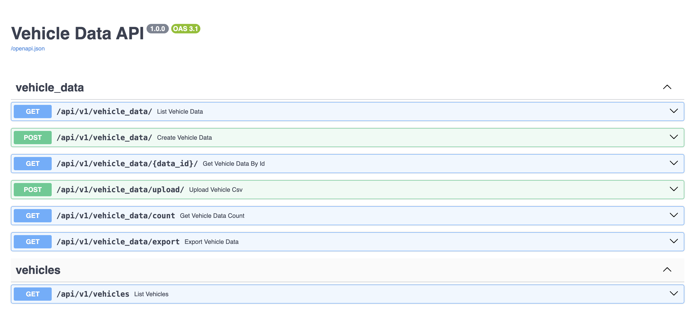

# 🚗 Volteras Technical Test => Vehicles Data Dashboard

A full-stack application to manage and visualize vehicle telemetry data using:

- **FastAPI** (Python backend)
- **React + React Bootstrap** (Frontend)
- **MySQL** (Relational database)
- **Docker Compose** (Container orchestration)

---

## 📦 Features

- Import vehicle CSV data
- Filter by vehicle, date range
- Sortable, paginated data table
- Export data as CSV, Excel, or JSON
- Line chart visualization (speed & SOC over time)
- RESTful API with versioning
- Full Docker support for dev and deployment

---

## 🛠️ Tech Stack

| Layer     | Stack                  |
|-----------|------------------------|
| Frontend  | React, React-Bootstrap |
| Backend   | FastAPI, SQLAlchemy    |
| Database  | MySQL 8                |
| Dev Tools | Docker, Docker Compose |

---

## 🚀 Getting Started

### 1. Clone the repo

```bash
git clone https://github.com/sidibos/volteras-test.git
cd volteras-test
```

### 2. Set environment variables
Create a file called .env in the same directory as `docker-compose.yml`:

```bash
MYSQL_USER=appuser
MYSQL_PASSWORD=secret
MYSQL_DBASE=vehicledb
MYSQL_ROOT_PASSWORD=rootpass
```
### 3. Start the full stack with Docker

```bash
docker-compose up  -d --build

```
### 4 API Endpoints (FastAPI)

| Method | Endpoint                           | Description                      |
| ------ | ---------------------------------- | -------------------------------- |
| GET    | `/api/v1/vehicle_data/`            | List vehicle data (with filters) |
| GET    | `/api/v1/vehicle_data/{data_id}`        | Get specific data row            |
| GET    | `/api/v1/vehicle_data/count`       | Count entries for pagination     |
| GET    | `/api/v1/vehicles`                 | Get list of unique vehicle IDs   |
| GET    | `/api/v1/vehicle_data/export`      | Export data as CSV, JSON, Excel  |
| POST   | `/api/v1/vehicle_data/upload` | Load sample CSV files into DB    |
| POST   | `/api/v1/vehicle_data/`            | Upload new records in batch      |


### 5. Navigate to URLS 
- Backend (fastAPI) FastAPI runs at: http://localhost:8080
- Frontend (React) at: http://localhost:3001

### 6. Upload the sample data
- Go the backend URL (swagger UI)
- Click on the endpoint `/api/v1/vehicle_data/upload`
- Upload the sample data
- Reload the frontend page to see Vehicle IDs in the dropdown

### 🧪 Testing
#### For the Backend (FastAPI) run the following command
```bash
docker exec -it fastapi_backend pytest
```

#### for the frontend do the followings
```bash
cd frontend
npm install
npm test
```

📊 Exports
From the frontend, you can export data using:
- CSV
- JSON
- Excel (.xlsx)

The export filename includes a timestamp.

📁 Folder Structure
```bash
├── backend/
│   ├── app/
│   ├── requirements.txt
├── frontend/
│   ├── src/
│   ├── package.json
├── docker-compose.yml
├── .env
└── README.md
```

## 📸 Screenshot

- 
- 

